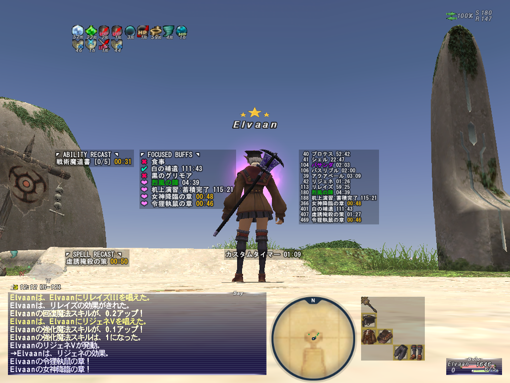

# 練習問題
簡易版`timers`

テキストベースでもよい

# TODO

## カスタムタイマー
* 追加/削除
* カウントアップ/カウントダウン

## バフタイマー
* ピン止め
* ホワイトリスト/ブラックリスト
* デバフの色付け
* 風水/召喚加護/マニューバ/ルーン
* 別名
* アビリティのリキャストもピン止め（バフと同一の扱い）

## リキャストタイマー
- 戦術魔導書のチャージ
    - レベル・ギフト
    
            Lv10 1 240s
            Lv30 2 120s
            Lv50 3 80s
            Lv70 4 60s
            Lv90 5 48s
            G550 5 33s
- しじさせろのチャージ
    - メリポ・ギフト
            
            メリポ -10s, -2s/メリポ
            G550 -5s
            装備 -5s (グレティブリーチズ etc)
- クイックドロー
    - メリポ・ギフト
    
            メリポ -10s, -2s/メリポ
            G550 -10s

## イメージ

